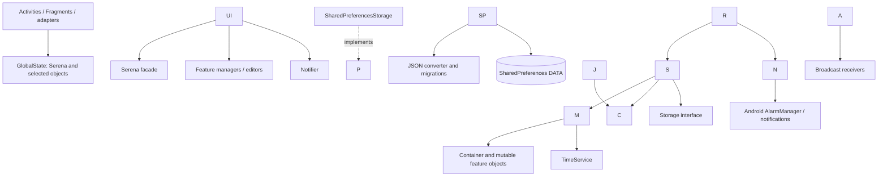

# Serena architecture analysis

Analysis date: 2026-09-21. Inspected checkout: `518fb67`, including the working tree. This report changes documentation only; none of its recommendations has been implemented.

## Scope and evidence

Serena is a single-module Java Android application for routines, chores, tasks, reminders, checklists, balances, sleep, and notes. Its architecture is a shared, mutable in-memory domain model, accessed through feature managers and editors, with Android screens coordinating persistence and notifications. It has useful separation by responsibility, but no consistently enforced presentation/application boundary. Calling it MVVM or Clean Architecture would obscure how it actually works.

The analysis inspected implementation, manifest, Gradle configuration, XML UI structure, all test-suite inventories and representative assertions, migration scripts, release tooling, and existing documentation. `AGENTS.md` and the testing/style documents were effectively blank on disk; the working principles supplied in the task were followed. This architecture document was initially empty. `CHANGELOG.md` describes recent task, sleep, and reminder changes; `RELEASE.md` documents unit-test/build verification and manual smoke checks, not automated lifecycle coverage.

Evidence labels used below:

* **Reproduced:** executed against the current compiled implementation on the JVM.
* **Source-demonstrated:** a concrete control-flow or state-management problem visible in implementation; Android symptoms have not necessarily been reproduced.
* **Risk/inference:** a plausible consequence requiring device, production-data, or performance evidence.
* **Optional improvement:** a maintainability opportunity without a demonstrated failure.

Unless otherwise qualified, Java paths below are relative to `app/src/main/java/stoneframe/serena/`; test paths are relative to `app/src/test/java/stoneframe/serena/`. Symbol references identify the relevant methods without depending on shifting line numbers.

## Component map and dependency directions

|Component|Responsibility and connections|Main evidence|
|-|-|-|
|Android application state|Holds the process-wide `Serena` instance and selected domain objects for navigation. It does not initialize or reload the model itself.|`gui/GlobalState.java`: `onCreate`, `getSerena`, `activeTask`, other `active\*` fields|
|Startup/navigation|Constructs storage, converters, clock, and initial chore policies; loads Serena; installs exception handling; replaces drawer fragments; sets up notification channels/alarms. Saves when stopped.|`gui/MainActivity.java`: `onCreate`, `goToFragment`, `onStop`|
|Screens and adapters|XML Views, Activities/Fragments, dialogs, and list adapters render objects and invoke managers/editors. They also decide when to save, refresh, and schedule alarms. `EditActivity` supplies common save/cancel/remove handling.|`gui/EditActivity.java`, `gui/today/TodayFragment.java`, `gui/util/SimpleListAdapter.java`, `app/src/main/res/layout/`|
|Root model/facade|Owns the current aggregate `Container`, storage port, clock, and broad change listeners. Creates lightweight feature managers on demand.|`Serena.java`: `load`, `save`, `get\*Manager`, `notifyChange`; `Container.java`|
|Routines|Daily, weekly, fortnightly procedures, enablement, pending occurrences, and next occurrence calculation.|`routines/RoutineManager.java`, `Routine.java`, `DayRoutine.java`, `WeekRoutine.java`, `FortnightRoutine.java`|
|Chores|Eligibility, urgency ordering, repetition, effort budgets, completion/skip/postpone. Selection and effort accounting are replaceable strategies.|`chores/ChoreManager.java`, `Chore.java`, `ChoreSelector.java`, `EffortTracker.java`, `choreselectors/`, `efforttrackers/`|
|Tasks/reminders|Task ordering, optional deadlines, daily slots, completion/undo/retention; reminder pending times, completion, and nine-minute snooze.|`tasks/TaskManager.java`, `TaskEditor.java`; `reminders/ReminderManager.java`|
|Other features|Checklist contents/check state; time-dependent balances and transactions; sleep state/sessions/scoring; notes and group membership.|`checklists/ChecklistManager.java`; `balancers/Balancer.java`, `BalancerManager.java`; `sleep/Sleep.java`, `SleepManager.java`; `notes/NoteManager.java`|
|Editing support|Editors expose operations and local listeners. Several entities support an in-memory checkpoint/revert mechanism using JSON deep copies. This is separate from durable saving.|`Editor.java`, `util/Revertible.java`, `util/DeepCopy.java`, feature `\*Editor.java`|
|Persistence|Serializes the whole aggregate into one SharedPreferences string. Runs ordered JSON upgrades and adapters for polymorphic model types and Joda time.|`Storage.java`; `storages/SharedPreferencesStorage.java`, `storages/JsonConverter.java`, `storages/json/ContainerJsonConverter.java`, `storages/versions/`|
|Android notifications|Two alarm chains, one for routines and one for reminders; receivers load/reuse the model, refresh active listeners, publish notifications, and schedule the next alarm.|`gui/notifications/Notifier.java`, `NotifierReceiver.java`, `RoutineNotifierReceiver.java`, `ReminderNotifierReceiver.java`|
|Time/testing seams|Injected `TimeService`, `Storage`, chore-selection and effort interfaces allow deterministic domain tests without Activities.|`timeservices/`; tests `mocks/MockTimeService.java`, `mocks/TestContext.java`|



Solid arrows show calls/access; the dotted arrow shows implementation of the storage port. `MainActivity` and `NotifierReceiver` are the two composition sites. A cold receiver creates a local Serena rather than publishing it to `GlobalState`.

Dependencies mostly point from Android UI toward domain code, and from concrete storage toward the `Storage` interface and model. Domain managers do not import GUI classes or call persistence. However, this is package-level organization within one Gradle module, not an enforced module boundary. `RoutineManager` exposes `android.util.Pair`; domain classes use AndroidX annotations; `Revertible` depends on Gson through `DeepCopy`. The core is substantially JVM-testable, but not entirely platform/serialization independent.

`NoteView` and `NoteGroupView` are model projections, not Android Views or lifecycle ViewModels. They retain a concrete `NoteContainer`, unlike managers that resolve it through a supplier.

### Build and deployment context

`settings.gradle` includes only `:app`. `app/build.gradle` sets minimum SDK 26, compile/target SDK 34, namespace `stoneframe.serena`, and installed application ID `stoneframe.chorelist`. It uses AndroidX/AppCompat/Material, Joda-Time, Gson, and JSON.org. The inspected configuration has Android Gradle Plugin 8.5.1 and Gradle wrapper 8.10.2. There is no Room database, Compose UI, WorkManager dependency, or dependency-injection framework in the inspected application.

`scripts/release.ps1` runs tests and assembles a signed release; `RELEASE.md` additionally calls for manual feature/migration smoke checks. No checked-in `app/src/androidTest` tests were found despite instrumentation dependencies. Root repositories include JCenter, and the dependency list includes Play Services Plus and AndroidX test JUnit as production dependencies. Their presence alone is not proof of a runtime defect; dependency removal or repository changes should be independently verified, not bundled into architectural repair. The offline verification here does not establish reproducibility on a clean machine.

## Representative end-to-end flows

### Startup and storage hydration

`MainActivity.onCreate` gets Serena from `GlobalState`. If absent, it constructs `SharedPreferencesStorage` with a `JsonConverter`, creates Serena with `RealTimeService`, `WeeklyEffortTracker`, and `SimpleChoreSelector`, then calls `load`. Storage reads preference file/key `DATA`; the converter upgrades JSON before deserializing the graph. If no saved value exists, `Serena.load` creates all eight feature containers and assigns schema version 29.

Managers returned by `Serena.get\*Manager` close over `() -> container.FeatureContainer`. Consequently an existing manager follows a later `Serena.load` replacement. Already-selected entities, editors, and note projections do not automatically rebind. After initialization, Main sets up channels and the two next alarms, then shows/restores a fragment.

### Add/edit and complete a task

`TodayFragment` or `gui/tasks/AllTasksFragment.java` creates/selects a task, places it in `GlobalState.activeTask`, and opens `EditTaskActivity` with an `ACTION` extra. The task itself and its identity are not conveyed in that Intent. `EditTaskActivity.createActivity` obtains `TaskEditor`; form values remain in widgets/local date fields until `onSave` sets the editor properties. `TaskEditor.save` adds a new task to its manager. Finally `EditActivity.saveClick` calls `Serena.save`, serializing the entire aggregate.

`TaskManager.getTodaysTasks` filters eligibility, orders deadlines, and applies remaining daily slots. Tasks due strictly before seven days from today may exceed the limit. A no-deadline task uses a maximum-date sentinel internally, mapped to `null` by `TaskEditor`. Completed tasks older than one week are removed during list queries.

On Today, a tap checks the row immediately and queues completion for two seconds. A second tap cancels it. The runnable calls `TaskManager.complete`, refreshes the adapter, and saves. `onPause` and `onStop` flush pending completions and remove their callbacks. Completion is idempotent; same-day undo restores a daily slot; counts reset on date change. These rules have tests in `SerenaTest`, including seven-day urgency boundaries, no-deadline ordering, repeated completion, and undo.

Chore completion uses the same UI delay but delegates to `ChoreManager.complete`: spend the applicable effort and reschedule the repetition. Routine completion delegates to `RoutineManager.procedureDone` and refreshes its notification before saving. Today composes these independent features; there is no separate cross-feature application service.

### Reminder delivery, snooze, and completion

`gui/reminders/EditReminderActivity.java` changes the reminder through its editor and the common edit base saves. `AllRemindersFragment.editReminderCallback` refreshes the list and schedules the earliest future reminder. `Notifier.scheduleAlarm` uses an explicit receiver PendingIntent and `setExactAndAllowWhileIdle(RTC\_WAKEUP, ...)`; it cancels that alarm when no future time exists. Routines use a separate receiver component, so the shared request code does not itself merge the two alarm identities.

On delivery, `ReminderNotifierReceiver.onReceive` reuses the live model or loads persisted data through `NotifierReceiver.getSerena`. It broadcasts a Serena change to local listeners, displays a channel notification containing pending reminder text, and schedules the next future reminder. It does not automatically complete the reminder or save the aggregate. Notification taps open Today via `MainActivity.handleIntent`.

`TodayFragment.onResume` shows pending reminder dialogs. Done marks a reminder complete; Snooze moves its time to injected now plus nine minutes. `handleReminder` saves, updates the existing notification, and schedules the next alarm. `onPause` dismisses and clears dialog references, a concrete safeguard against accumulated popups. `Notifier.SerenaNotificationChannel.show` also avoids creating a new notification during a non-alerting refresh if none is currently showing. The two reminder tests verify snooze time and removal on pending-list access; they do not verify Android delivery or dialogs.

### Sleep and checklist mutations reveal different save contracts

`SleepFragment` toggles `SleepManager`, whose `Sleep` object records sleep start or appends a completed session. Scores and history are computed on demand; no background sleep timer runs. `Sleep.getPercent`/`getSessions` prune sessions outside a moving three-day window. Range normalization and invalid-session rejection have substantial coverage in `SleepTest`. Manual add/edit/remove session actions explicitly save. Toggle and settings changes instead rely on a later `MainActivity.onStop` save.

`ChecklistActivity` is a separate Activity. It directly changes `ChecklistItem.setChecked` or resets items, with no persistence call or stop-save of its own. Main may already have saved and stopped when this screen opened. Backgrounding directly from this screen therefore leaves these later changes only in memory until another save occurs. Returning to Main and subsequently stopping it can persist them; that normal path does not cover process death while the checklist screen is backgrounded.

### Raw data replacement

`MainActivity.onOptionsItemSelected` saves, reloads storage, serializes it, and passes the full JSON through an Intent to `StorageActivity`. Save returns edited text. `MainActivity.editStorageCallback` writes the text directly to SharedPreferences with `apply`, then calls `serena.load`. It does not validate first, preserve a recovery copy, clear selected objects, notify model listeners, or reschedule alarms. This path bypasses the `Storage` abstraction for the write. Clipboard paste confirmation protects against accidental text replacement in the editor, not invalid persisted data.

## State ownership, lifecycle, and threading

The durable logical state is one `Container` graph. The live owner is Serena; feature managers resolve and mutate portions of that graph. Collections sometimes return copies or unmodifiable views, but their elements remain live mutable objects. Package-private setters and editors restrict some operations; public checklist items and effort trackers expose others. Getter-shaped calls are not always pure: task/reminder queries remove objects, sleep queries prune history, and chore queries can reset daily effort or sort stored lists.

Transient state has several owners:

* `GlobalState`: process-local selected entities and Serena reference.
* Activities/Fragments: input fields, selected dates, navigation selection, dialog state, adapters, and Today undo timers.
* Entities: transient `Revertible.checkpoint` snapshots, created by selected editors.
* Android: view restoration, Activity back stack, notification channels, and scheduled alarms.

`Revertible.save` only updates an in-memory checkpoint; editor `save` may add an entity or checkpoint it; `Serena.save` persists the graph. These are three different meanings of save. Routine/checklist editors can mutate live state before Save and revert on Cancel, whereas the task editor screen delays applying form fields. Checkpoints are transient and do not isolate drafts from other consumers of the shared graph. A receiver can observe an in-progress routine edit while the process is alive. This is a risk from shared ownership, not evidence of simultaneous background writes.

There is no application-defined `onSaveInstanceState` recovery for selected entities/drafts. `GlobalState.onCreate` only registers its singleton; normal initialization occurs in Main. A restored detail Activity can therefore find no Serena or selected entity and dereference null, e.g. `EditTaskActivity.createActivity` or `ChecklistActivity.onCreate`. Keeping state in an Application helps same-process navigation/configuration changes but cannot restore it in a new process. This conclusion follows the implementation and Android's [process lifecycle contract](https://developer.android.com/guide/components/activities/process-lifecycle); a device reproduction was not performed.

UI callbacks, Today Handler work, and ordinary receiver callbacks use the main thread; no executor or durable job queue was found. Serialization, JSON upgrading, deep copies, filtering, sorting, and receiver hydration occur synchronously on their caller. `SharedPreferences.apply` does not move the preceding Gson serialization off that thread. Full-graph saves and repeated adapter suppliers are therefore potential latency costs as data grows, not measured ANRs. `SimpleListAdapter.getCount`, `getItem`, and `getView` each query their supplier; one render can repeatedly recompute lists.

The limited `synchronized` methods in Today/GlobalState do not establish a global thread-safety contract. The mostly single-thread execution model reduces current race exposure. Moving storage or managers to a worker without an immutable snapshot/ordered ownership rule would introduce new races.

Listener handling is manual. Today registers in both `onStart` and `onResume`, while Serena stores a `LinkedList` permitting duplicates. Each broadcast therefore calls it twice while resumed. Matching pause/stop removals prevent this from being an automatically accumulating leak on an ordinary lifecycle, but do not prevent duplicate work. Feature editors such as `DayRoutineActivity` add/remove their local listeners on start/stop.

Two further resource risks sit outside domain logic: `SpeechRecognizerUtil.setup` creates a recognizer with callbacks capturing UI objects but exposes no destroy handle; `MyExceptionHandler` is installed process-wide with a MainActivity context and creates a new thread/Looper/dialog instead of delegating to the prior uncaught-exception handler. No resource leak or crash-recovery behavior was measured. These deserve bounded lifecycle fixes, not a domain rewrite.

## Background work and alarm recovery

The only durable scheduling mechanism found is AlarmManager. Each feature schedules one next future event and advances that chain in its receiver. This avoids a continuously running service. Cold receiver loading is an important safeguard against ordinary process eviction: alarms do not depend exclusively on a live Activity.

Recovery is incomplete:

* **Source-demonstrated gap:** the manifest has only the two explicit alarm receivers, with no boot receiver or `RECEIVE\_BOOT\_COMPLETED`. Android clears alarms at shutdown; Serena has no automatic path to restore them after boot until it is opened again. Future events can be scheduled on reopening, but already-past reminders are excluded by `getNextReminderTime`. Today can still show pending reminders. See Android's [alarm lifecycle guidance](https://developer.android.com/develop/background-work/services/alarms).
* **Source-demonstrated gap:** notification permission is requested in `AllRoutinesFragment.checkNotificationAndExactAlarmsPermissions`, not the reminder flow. A fresh-install user who only creates reminders may never encounter that request. Android 13+ disables ordinary notifications until permission is granted; manifest declaration alone does not grant it. See [notification runtime permission](https://developer.android.com/develop/ui/compose/notifications/notification-permission).
* **Conditional risk:** `Notifier.scheduleAlarm` itself has no capability check/fallback. The check in the routines screen can occur after Main has already scheduled. Do not generalize this into “all Android 14 installs crash”: the manifest declares both exact-alarm permissions, and `USE\_EXACT\_ALARM` is automatically granted on supporting versions. The denied-capability case, particularly API 31/32, needs device testing. See [exact-alarm permissions](https://developer.android.com/develop/background-work/services/alarms).
* **Risk/inference:** time-zone/clock changes and exact-alarm permission grants have no dedicated rescheduling path. Stored Joda `LocalDateTime` values have no zone; conversion to an epoch happens when scheduling. Intended wall-clock behavior across these changes and DST needs explicit tests.

Missing WorkManager is not itself a weakness: the current requirement is user-timed notification delivery, already represented by alarms. Permission and recovery handling can be repaired around the existing scheduler.

## Persistence and migration findings

`SharedPreferencesStorage` stores the entire graph under one key; there are no row-level transactions, database queries, or separate repositories per feature. This is straightforward for a small personal dataset and preserves one aggregate snapshot per save. It also couples unrelated features' write cost and availability to the same serialization/load path.

`ContainerJsonConverter` reflects model fields into JSON and registers Joda and polymorphic adapters. Renaming/restructuring private model fields can therefore change the disk schema. Routine deserialization switches on `routineType`; unknown types return null. Chore strategy adapters are selected by construction rather than a general strategy discriminator. These are maintainability constraints on model changes, not a reason to replace storage immediately.

`JsonConverter.upgrade` reads `Version` (defaults to zero), applies consecutive scripts through 29, and stamps each resulting version. Migrations transform a parsed object before Gson hydration. Ordinary load does not write upgraded JSON back immediately; the next save does. Thus a failed ordinary migration does not itself overwrite the stored original. Several older upgrades use real current time when introducing fields, so repeated load-before-save can assign different defaults.

### Reproduced migration defect

`storages/versions/UpgradeScriptVersion23.java#upgrade` creates `SleepContainer` with direct `startDateTime`, `state`, and `sleepSessions` fields. Version 24 changes notes only. `UpgradeScriptVersion25.java#upgrade` requires `SleepContainer.sleep.sleepSessions`; version 28 also expects that nested shape.

A temporary JVM probe invoked the real `JsonConverter.fromJson` with:

```json
{"Version":22,"NoteContainer":{"notes":\[]}}
```

It failed at version 25 with `org.json.JSONException: JSONObject\["sleep"] not found.` The fixture is deliberately minimal for this segment of the chain, not a complete historical user backup. Additional unrelated containers do not fix the shape generated by version 23. Consequently older inputs that traverse this segment can fail to load; this is demonstrated converter behavior, not a speculative migration concern. No production user backup was exercised.

The existing `UpgradeScriptVersion29Test.upgrade\_addsUnlimitedTaskSettings` passes, but tests only one script in isolation. It does not challenge the version-23-to-25 boundary. A current empty version-29 container also round-tripped successfully in the probe; the finding does not mean all storage loading is broken.

### Import and compatibility validation gaps

The same probe demonstrated that `{"Version":29}` deserializes with null feature containers, and a current container restamped version 30 is accepted. The loader neither validates aggregate completeness nor rejects future versions. Combined with `MainActivity.editStorageCallback` persisting text before parsing, malformed or incomplete imports can replace the last usable value and then fail immediately or on feature access. Future-version data may lose unknown fields on a later save. The parser results are **reproduced**; permanent loss after an Android import and disk-write completion is a **risk**, not a reproduced device outcome.

Whole-JSON Intent transport is also a dataset-size risk. No large-data transport limit, save-duration benchmark, or on-disk failure was tested.

## Architectural assessment and prioritized recommendations

### Existing strengths

* **Cohesive feature logic:** recurrence, chore selection, task budgeting, balance arithmetic, and sleep scoring live largely outside screens. `TodayFragment` can compose managers without duplicating their algorithms.
* **Useful test seams:** constructor-supplied clocks, storage, and chore policies support fast boundary tests. All 146 existing tests pass. Richer task and sleep coverage directly contradicts a claim that their recent changes lack tests.
* **Small infrastructure surface:** one aggregate and explicit construction make initialization and persistence traceable. Supplier-backed managers survive aggregate replacement better than managers holding old containers.
* **Practical safeguards:** editor validation, checkpoint/revert in applicable editors, idempotent task completion, Today callback flushing/dialog cleanup, cold receiver loading, channel management, and ordered migrations are already present.

The dominant weakness is that cross-cutting application responsibilities—durability, restoration, scheduling, refresh, and draft ownership—are distributed across screens. Feature cohesion is stronger than lifecycle/integration cohesion. Missing safeguards can coexist with well-tested domain calculations.

### Priority 1: protect stored data and recoverable user state

|Finding and evidence status|Smallest sufficient change|Tradeoff and falsifying verification|
|-|-|-|
|Broken sleep migration chain (**reproduced**), versions 23/25|Repair the legacy-shape transition before version 25 reads it; explicitly accept both the flat legacy shape and the already-nested shape. Add representative migration-chain fixtures.|Fixing only the producer in version 23 would miss already-saved flat version-23/24 inputs. A new final migration alone cannot repair a failure that occurs earlier. Test 22, flat/nested 23/24, and current inputs, then round-trip and inspect preserved data.|
|Unvalidated replacement of persisted JSON (**source-demonstrated**, parser gaps **reproduced**)|Parse, upgrade, and validate a candidate before replacing storage; reject unsupported future versions; retain the previous value on failure. Route replacement through storage/Serena, then clear stale selections, refresh screens, and reschedule alarms.|Adds an explicit import operation and error UI, but can keep SharedPreferences/Gson. Test invalid syntax, missing containers, unknown routine types, future versions, and unchanged prior data after each rejection.|
|Detail Activity restoration depends on lost globals (**source-demonstrated**; device crash unverified)|Centralize idempotent model initialization accessible to all entry points. As an immediate containment, detect missing selection and return safely to the list. For actual restoration, pass stable entity IDs and save draft state for each editor incrementally.|Safe fallback loses an unsaved draft; full restoration needs persistent IDs/migrations for entities without them. A ViewModel alone does not restore process-lost identity. Test recreation and actual background-process death separately, including an editor and ChecklistActivity.|
|Checklist changes have no persistence boundary (**source-demonstrated**; loss on process death inferred)|Save after check/reset actions, or at a clearly defined checklist-owned boundary that runs when that Activity backgrounds. Keep the existing storage API. Make toggle/settings save policy explicit for sleep too.|Saving each tap writes the entire graph more often; a stop boundary delays durability. Test changing an existing checklist, backgrounding from that screen, killing the process, and reloading without returning through Main.|

### Priority 2: make reminder delivery and integration predictable

|Finding and evidence status|Smallest sufficient change|Tradeoff and falsifying verification|
|-|-|-|
|No boot recovery; notification permission tied to routines; scheduler assumes capability (**source-demonstrated gaps**, device effects unverified)|Share one small scheduling/permission coordinator across startup, reminders, routines, and recovery receivers. Restore next alarms on boot, and handle capability grant/time changes as required. Check exact-alarm capability at the scheduling boundary and expose an explicit unavailable/degraded state.|More platform cases, but no job framework is needed. An inexact fallback changes timing and must be a deliberate choice. Test fresh reminder-only installation, denial/grant on API 31/32 and 33/34, cold delivery, reboot, and time-zone change.|
|Duplicate Today listener registration (**source-demonstrated**)|Register/remove in one matching lifecycle pair. Preserve pause-time completion flushing and reminder dismissal.|Changes refresh timing slightly. Count one listener invocation while resumed and zero after stop; verify returning from child screens still refreshes.|
|Live editor drafts and scattered save/refresh/schedule calls (**risk/inference**)|Document commit/cancel behavior, then give the specific affected editor an isolated draft or explicit commit operation. Extract a small shared operation only where multiple callers need the same save/reschedule sequence.|Copies cost memory and require careful identity reconciliation. Do not introduce a universal use-case layer solely for symmetry. Test Cancel, another save while a draft is open, alarm delivery during routine editing, and aggregate replacement.|
|Test coverage stops before integration boundaries (**verified inventory**)|Add migration-chain/JSON round-trip tests first; then a small Android lifecycle/persistence/notification test set supporting the above fixes.|JVM tests stay fast; device tests cost setup and can be timing-sensitive. Use deterministic scheduling seams where possible, but retain a few real platform checks.|

### Priority 3: focused maintainability and performance improvements

1. **Complete clock injection where behavior depends on time.** `reminders/ReminderManager.java#createReminder` and `sleep/SleepContainer.java` initialization call the real clock despite manager-level injection. Pass the existing clock/current date through these paths as they are changed. This improves deterministic tests without a new time framework; changing migration defaults needs compatibility consideration.
2. **Make resource cleanup explicit.** Return a lifecycle-owned recognizer handle from `SpeechRecognizerUtil.setup`, and replace the global Activity-retaining exception dialog strategy with bounded logging/delegation. Test teardown and callbacks after navigation. These are resource risks, not measured leaks.
3. **Measure before changing storage/threading.** Profile a representative large dataset, full saves, cold receiver loading, and adapter queries. Cache a list snapshot per refresh if repeated computation is material. If saves must move off-thread, snapshot state and serialize writes in order. SharedPreferences-to-database migration adds schema and transaction work; current evidence does not establish that it is necessary.
4. **Keep domain boundaries incremental.** A small Java value type could replace `android.util.Pair` when routine overview tests need it. Clarify checkpoint versus durable-save names in touched APIs. Clean up unused dependencies only after usage/build checks. Splitting modules, introducing repositories for every feature, adopting MVVM everywhere, or rewriting in Kotlin has no demonstrated payoff for the failures identified here.

## Verification performed and limits

Verification used the existing checkout and local cached dependencies. The initial sandboxed Gradle invocation failed on a Gradle wrapper cache lock outside the writable workspace; the permitted rerun using that cache succeeded. There was no application-source or test-source modification.

|Check|Result and what it establishes|
|-|-|
|`./gradlew.bat :app:testDebugUnitTest :app:lintDebug --offline --console=plain`|Successful; debug Java/resources/manifest processing and lint completed. The test task was initially up to date, so it was explicitly rerun next.|
|`./gradlew.bat :app:testDebugUnitTest --rerun --offline --console=plain`|Fresh execution successful: **146 tests across 11 suites, zero failures/errors/skips**. Reports: `app/build/test-results/testDebugUnitTest/`.|
|Android lint|**0 errors, 361 warnings** in `app/build/reports/lint-results-debug.xml` and `.html`. Largest category: 220 hardcoded-text warnings; also overdraw, autofill, RTL, and layout/accessibility findings. These do not validate runtime lifecycle or migration correctness. `Notifier` suppresses `MissingPermission` at notification posting.|
|Temporary JVM probe of compiled production classes|Legacy migration segment fails at version 25; current empty version-29 graph round-trips; incomplete current graph and future version are accepted. Probe source was placed only under ignored `app/build/architecture-audit/`, using the existing cached JSON/Gson/Joda jars. No real preference store or user data was modified.|
|Source cross-checks|Traced all saves in the representative flows; checked receiver fallback, manifest registrations, permission requests, listener add/remove pairs, migration shapes, and tests that could contradict findings.|

The suites cover `SerenaTest` (46), sleep (27), fortnight routines (23), balances (16), week routines (11), chore entities (9), chore ordering (8), day routines (2), reminders (2), chore manager (1), and version-29 migration (1). Task behavior is covered in `SerenaTest`, despite no separate task test directory. `routines/RoutineTest.java` contains commented-out tests and contributes no executed tests. Mock storage does not exercise Android persistence; `MockStorage.save` is a no-op. No UI, permission, boot recovery, or full migration-chain test was found in the checked-in suites.

No emulator/device run, APK installation, signed release build, process-death reproduction, reboot test, production backup migration, performance profiling, leak measurement, or disk-failure test was performed. The build emitted deprecated API/unchecked-operation and Java 21/source-target 8 warnings, plus Gradle deprecation warnings; successful offline checks do not prove a clean-machine build. Mermaid syntax was reviewed as text, not rendered by a diagram engine.

The evidence supports retaining Serena's feature managers and existing test seams while repairing migration validation, lifecycle recovery, persistence boundaries, and alarm integration first.

